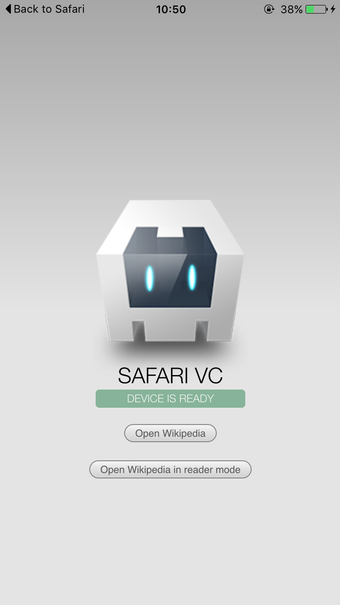
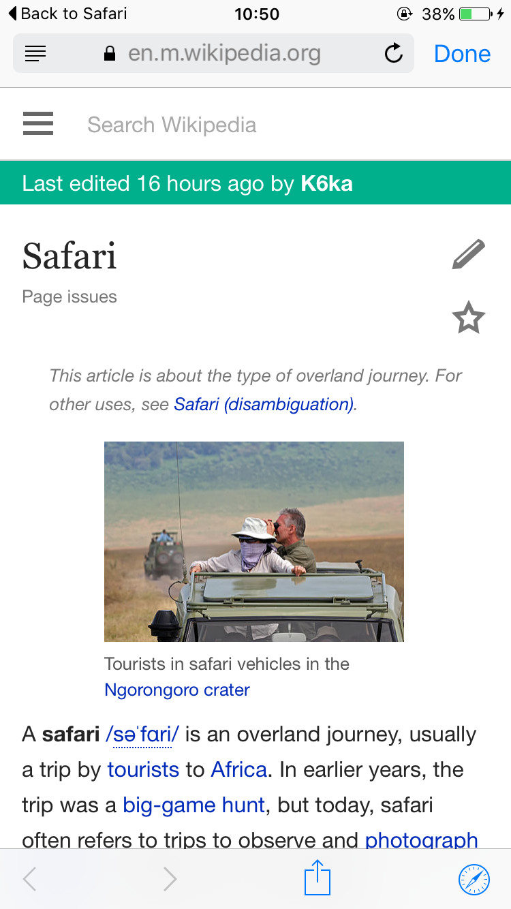
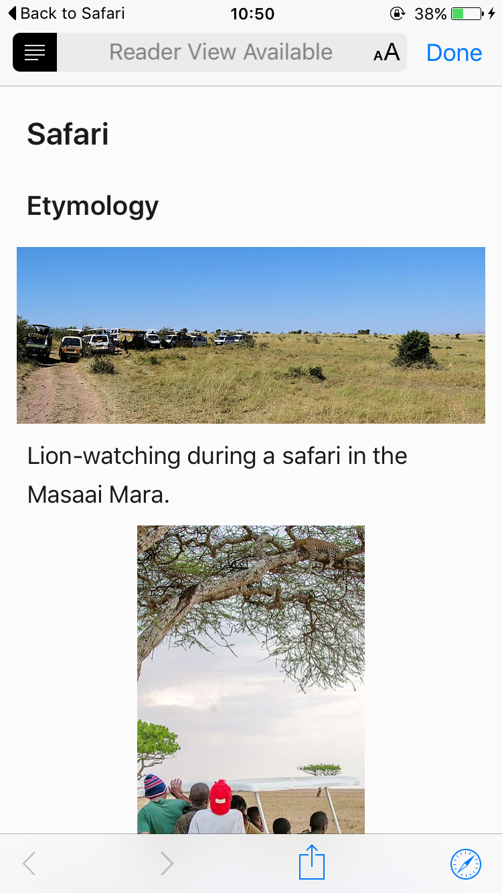
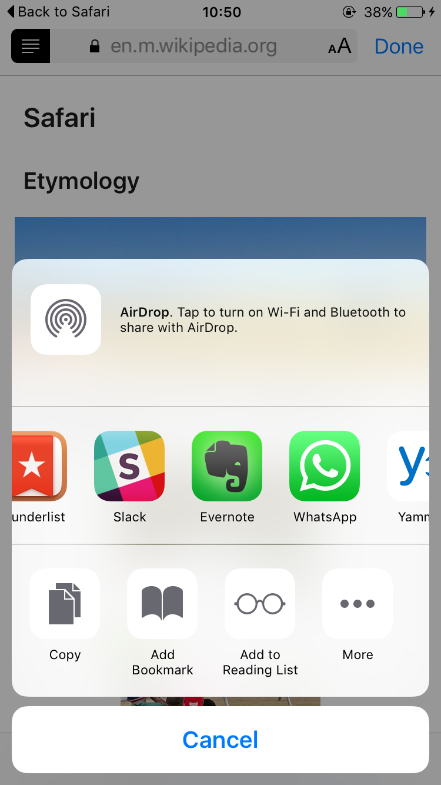
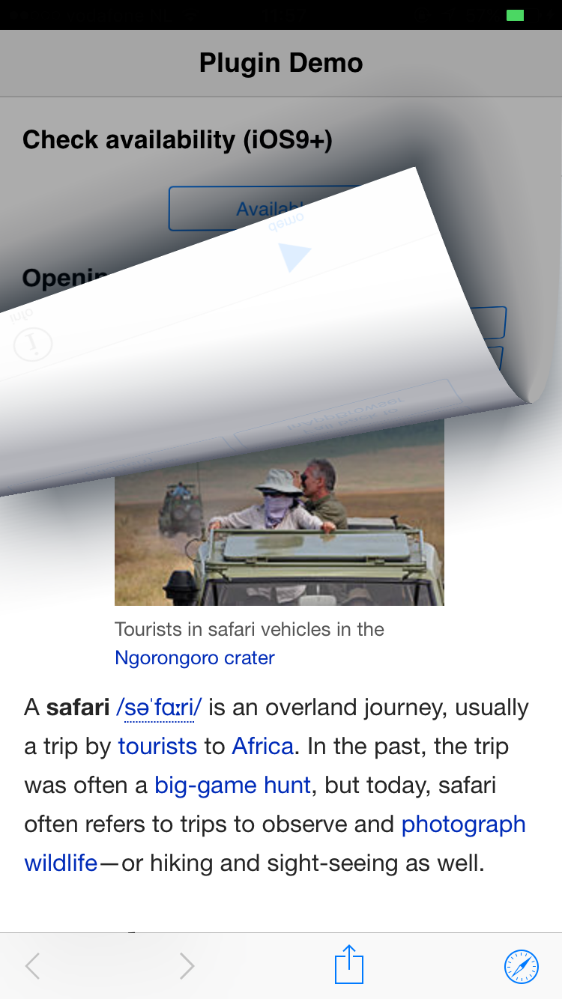
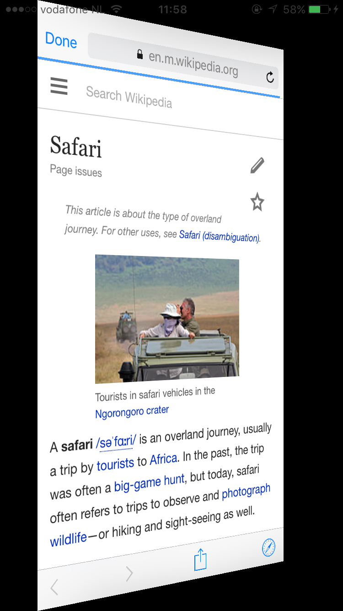
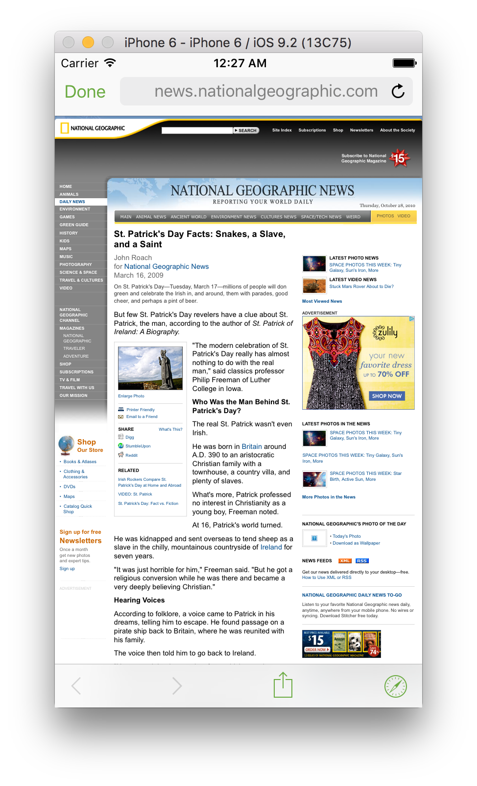
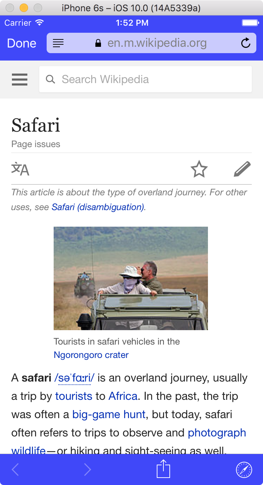

SafariViewController Cordova Plugin
===================================
by Eddy Verbruggen - [@eddyverbruggen](https://twitter.com/eddyverbruggen)

## 0. Index

1. [Description](#1-description)
2. [Screenshots](#2-screenshots)
3. [Installation](#3-installation)
4. [Usage](#4-usage)
5. [Advantages over InAppBrowser](#5-advantages-over-inappbrowser)
6. [Reading Safari Data and Cookies with Cordova](#6-reading-safari-data-and-cookies-with-cordova)
7. [Changelog](#7-changelog)

## 1. Description
* Use in cases where you'd otherwise use InAppBrowser
* Use the new and powerful iOS9 viewcontroller to show webcontent in your PhoneGap app
* Requires XCode 7 / iOS9 SDK to build
* Requires iOS9 to use, lower versions need to fall back to InAppBrowser (example below!)
* [Chrome custom tabs](https://developer.chrome.com/multidevice/android/customtabs) are Android's parallel to SafariViewController with even more customizable UI. You can give it a try with the latest version of this plugin. See [the wiki](https://github.com/EddyVerbruggen/cordova-plugin-safariviewcontroller/wiki) for details.

Note that I didn't decide to clobber window.open to override InAppBrowser when applicable
because that would mean you could never use InAppBrowser in case you need its advanced features
in one place and are happy with a simple readonly view in other cases.

## 2. Screenshots
As you can see from these shots: you can preload a page in reader mode or normal mode,
and Safari gives you the option to use the share sheet!

Pressing 'Done' returns the user to your app as you'd expect.

&nbsp;
&nbsp;
&nbsp;
&nbsp;
&nbsp;
&nbsp;

This one has a custom `tintColor` (check the buttons):



On iOS 10, you can use `barColor` and `controlTintColor` as well
(to make sure iOS 9 buttons are not white in the case, pass in a `tintColor` as well):



## 3. Installation
To install the plugin with the Cordova CLI from npm:

```
$ cordova plugin add cordova-plugin-safariviewcontroller
```

### Graceful fallback to InAppBrowser
Since SafariViewController is new in iOS9 you need to have a fallback for older versions (and other platforms),
so if `available` returns false (see the snippet below) you want to open the URL in the InAppBrowser probably,
so be sure to include that plugin as well:

```
$ cordova plugin add cordova-plugin-inappbrowser
```

I'm not including it as a depency as not all folks may have this requirement.

## 4. Usage
Check the [demo code](demo/index.html) for an easy to drop in example, otherwise copy-paste this:

```js
function openUrl(url, readerMode) {
  SafariViewController.isAvailable(function (available) {
    if (available) {
      SafariViewController.show({
            url: url,
            hidden: false, // default false. You can use this to load cookies etc in the background (see issue #1 for details).
            animated: false, // default true, note that 'hide' will reuse this preference (the 'Done' button will always animate though)
            transition: 'curl', // (this only works in iOS 9.1/9.2 and lower) unless animated is false you can choose from: curl, flip, fade, slide (default)
            enterReaderModeIfAvailable: readerMode, // default false
            tintColor: "#00ffff", // default is ios blue
            barColor: "#0000ff", // on iOS 10+ you can change the background color as well
            controlTintColor: "#ffffff" // on iOS 10+ you can override the default tintColor
          },
          // this success handler will be invoked for the lifecycle events 'opened', 'loaded' and 'closed'
          function(result) {
            if (result.event === 'opened') {
              console.log('opened');
            } else if (result.event === 'loaded') {
              console.log('loaded');
            } else if (result.event === 'closed') {
              console.log('closed');
            }
          },
          function(msg) {
            console.log("KO: " + msg);
          })
    } else {
      // potentially powered by InAppBrowser because that (currently) clobbers window.open
      window.open(url, '_blank', 'location=yes');
    }
  })
}

function dismissSafari() {
  SafariViewController.hide()
}
```

## 5. Advantages over InAppBrowser
* InAppBrowser uses the slow UIWebView (even when you're using a WKWebView plugin!), this plugin uses the ultra fast Safari Webview.
* This is now Apple's recommended way to use a browser in your app.
* A nicer / cleaner UI which is consistent with Safari and all other apps using a `SFSafariViewController`.
* Whereas `cordova-plugin-inappbrowser` is affected by [ATS](https://developer.apple.com/library/prerelease/ios/technotes/App-Transport-Security-Technote/), this plugin is not. This means you can even load `http` URL's without whitelisting them.
* Since iOS 9.2 or 9.3 you can swipe to go back to your app. Unfortunately, in favor of this Apple dropped the option to provide a custom transition (curl/flip/..) when presenting Safari.

## 6. Reading Safari Data and Cookies with Cordova

SFSafariViewController implements "real" Safari, meaning private data like cookies and Keychain passwords are available to the user. However, for security, this means that communication features such as javascript, CSS injection and some callbacks that are available in UIWebView are not available in SFSafariViewController.

To pass data from a web page loaded in SFSafariViewController back to your Cordova app, you can use a Custom URL Scheme such as _<mycoolapp://data?to=pass>_.  You will need to install an addition plugin to handle receiving data passed via URL Scheme in your Cordova app.

Combining the URL Scheme technique with the HIDDEN option in this plugin means you can effectively read data from Safari in the background of your Cordova app. This could be useful for automatically logging in a user to your app if they already have a user token saved as a cookie in Safari.

Do this:

1. Install the [Custom URL Scheme Plugin](https://github.com/EddyVerbruggen/Custom-URL-scheme)
2. Create a web page that reads Safari data on load and passes that data to the URL scheme:

    ```javascript
    <html>
      <head>
        <script type="javascript">
          function GetCookieData() {
            var app = "mycoolapp"; // Your Custom URL Scheme
            var data = document.cookie; // Change to be whatever data you want to read
            window.location = app + '://?data=' + encodeURIComponent(data); // Pass data to your app
          }
        </script>
      </head>
      <body onload="GetCookieData()">
      </body>
    </html>
    ```

3. Open the web page you created with a hidden Safari view:

    ```javascript
    SafariViewController.show({
      url: 'http://mycoolapp.com/hidden.html',
      hidden: true,
      animated: false
    });
    ```

4. Capture the data passed from the web page via the URL Scheme:

    ```javascript
    function handleOpenURL(url) {
      setTimeout(function() {
        SafariViewController.hide();
        var data = decodeURIComponent(url.substr(url.indexOf('=')+1));
        console.log('Browser data received: ' + data);
      }, 0);
    }
    ```


## 7. Changelog
* 1.5.3 Hidden tabs don't get removed on `hide()` (iOS). Thanks #104!
* 1.4.3 Options weren't correctly passed to native code. Thanks #19!
* 1.4.2 When passing a URL not starting with http/https the error callback will be invoked.
* 1.4.1 You can now set the color of the navbar and tabbar buttons. Thanks #16!
* 1.4.0 Added a `hidden` property to `show`.
* 1.3.0 `isAvailable` plays nice with non-iOS platforms. Added a `transition` property to `show`.
* 1.2.0 Added lifecycle events to the success handler of `show`, and added the `animated` property to `show`.
